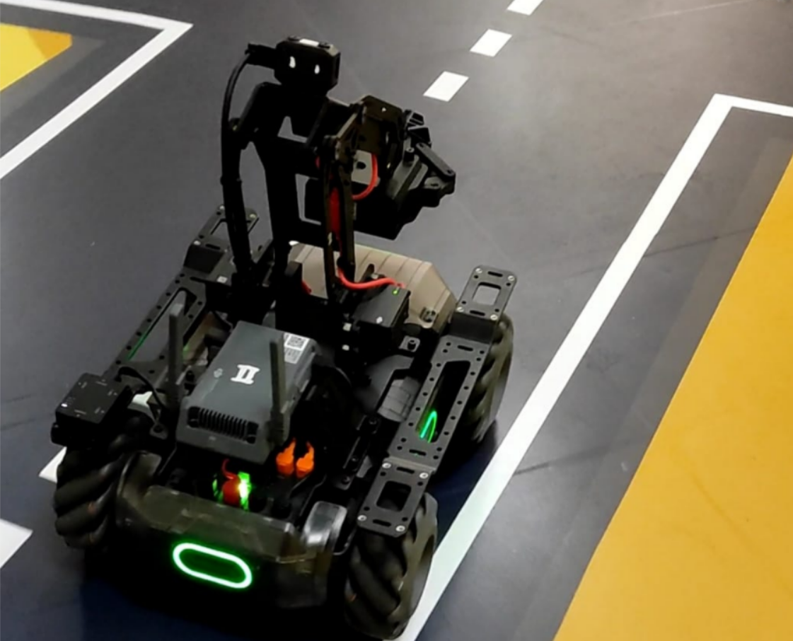
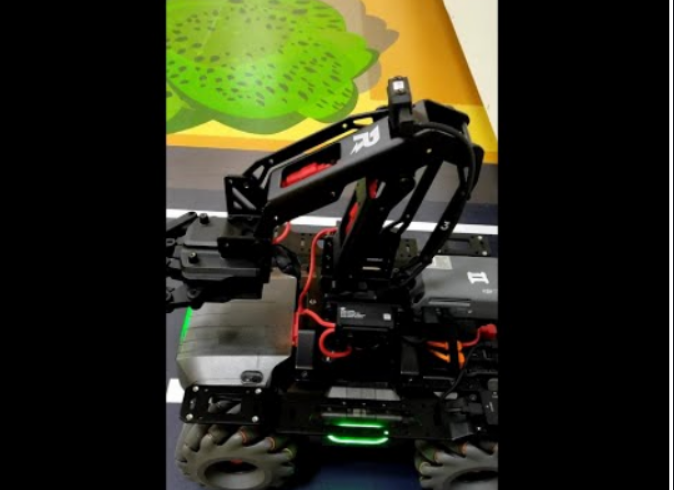

# MobileRobot-Openloopcontrol
## Aim:

To develop a python control code to move the mobilerobot along the predefined path.

## Equipments Required:
1. RoboMaster EP core
2. Python 3.7

## Procedure

# Step1:

Use from robomaster import robot.

# Step2:

Choose the x,y,z - axis movement distance(meters).

# Step3:

Give ep_chassis.move to move straight.

# Step4:

Give time.sleep() for a break.

# Step5:

Give ep_chassis.drive_speed to have a circular movement.

## Program
```python
  from robomaster import robot
import time

if __name__ == '__main__':
    ep_robot = robot.Robot()
    ep_robot.initialize(conn_type="ap")

    ep_chassis = ep_robot.chassis

        '''
    x = speed in x direction( meter/second) [-3.5,3.5]
    y = speed in y direction( meter/second) [-3.5,3.5]
    z = rotation about z axis ( degree/second)[-600,600]
    '''
    ep_chassis.move(x=2.3, y=0, z=0, xy_speed=0.75).wait_for_completed()
    ep_chassis.drive_speed(x=0.2,y=0,z=-20)
    ep_chassis.drive_speed(x=0.5,y=0,z=-20)
    ep_chassis.drive_speed(x=0.5,y=0,z=-20)
    time.sleep(2)

    ep_robot.close()

```

## MobileRobot Movement Image:





## MobileRobot Movement Video:

Upload your video in Youtube and paste your video-id here

[](https://www.youtube.com/watch?v=3H1jTW35Crw)


## Result:
Thus the python program code is developed to move the mobilerobot in the predefined path.
